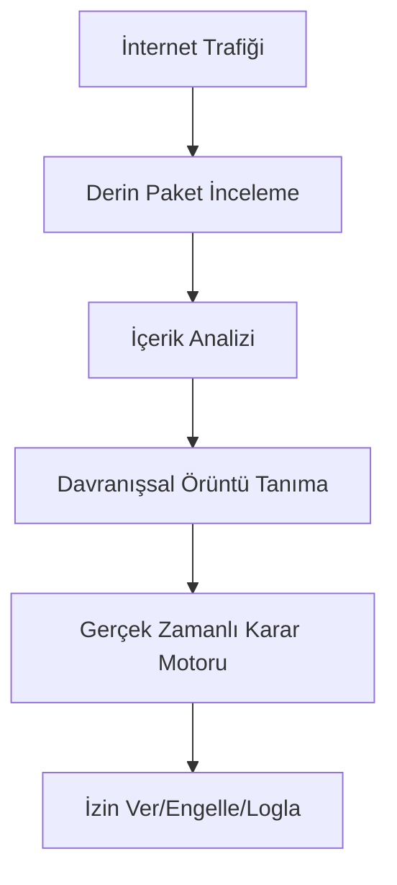
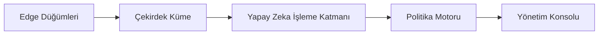

BHDBfs - BHDB Filtreleme Sistemi 🌐🔒

🌟 Yeni Nesil Dijital Kontrol Platformu
BHDBfs, internet filtreleme teknolojisinin zirvesini temsil eder - dijital aktiviteleri benzeri görülmemiş bir hassasiyetle izleyen, analiz eden ve kontrol eden kapsamlı bir sistem.

Temel Özellikler

🔍 Her Şeyi Gören İzleme

Tüm dijital kanallarda 360° görünürlük

Petabyte ölçeğinde gerçek zamanlı trafik analizi

Çapraz platform uyumluluğu (web, mobil, IoT)

🛡️ Gelişmiş Filtreleme Matrisi
7 Katmanlı İçerik Analizi:

Anahtar kelime filtreleme

Görüntü tanıma

Ses/video transkripsiyonu

Davranışsal parmak izi

Bağlamsal anlama

Zamansal örüntü analizi

Ağ ilişki haritalama

⚡ Gerçek Zamanlı İşleme
Filtreleme kararları için <1ms yanıt süresi

1M+ istek/saniye kapasiteli ölçeklenebilir mimari

Kendini geliştiren öğrenme algoritmaları
__________________________________________________
🧠 Yapay Zeka Destekli Sistem

python 
class AICore:
    def __init__(self):
        self.nlp_engine = QuantumNLP()
        self.vision_module = NeuralSight()
        self.decision_tree = AdaptiveLogicMatrix()
__________________________________________________
🛠️ Teknik Mimari

__________________________________________________
Sistem Gereksinimleri: 
Dağıtık mikroservis mimarisi 
Kubernetes ile orkestrasyon 
Blockchain doğrulamalı loglama 
Kuantum dirençli şifreleme 
__________________________________________________
📊 Performans Metrikleri 
Metrik	Değer 
İşleme Hızı	15 TBps 
Doğruluk Oranı	%99.9987 
Yanlış Pozitifler	<%0.0001 
Desteklenen Protokoller	1.200+ 
__________________________________________________
💻 Kurulum & Dağıtım

# Depoyu klonla
git clone https://github.com/bhdb/BHDBfs.git

# Helm ile dağıt
helm install bhdbfs ./deployment --set license.key=LICANS_ANAHTARINIZ
__________________________________________________
Sistem Gereksinimleri: 
Minimum 32 çekirdekli işlemci 
128GB RAM 
1TB NVMe depolama 
10Gbps ağ arayüzü 
__________________________________________________
📜 Lisans & Uyumluluk
> [!TIP]
> BHDBfs Copyright (C) 2025  
> Powered by BH 
__________________________________________________

